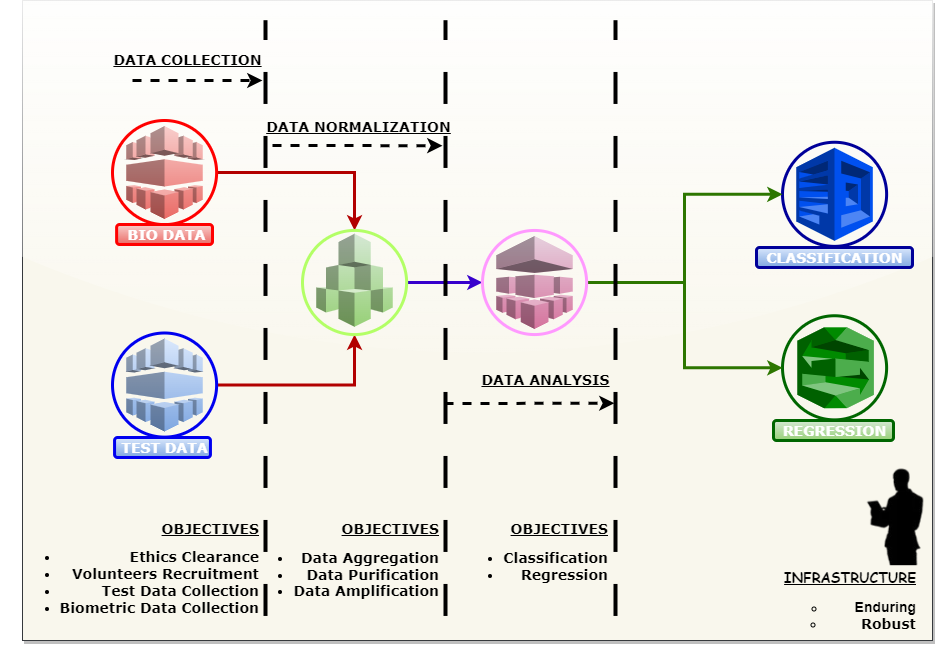
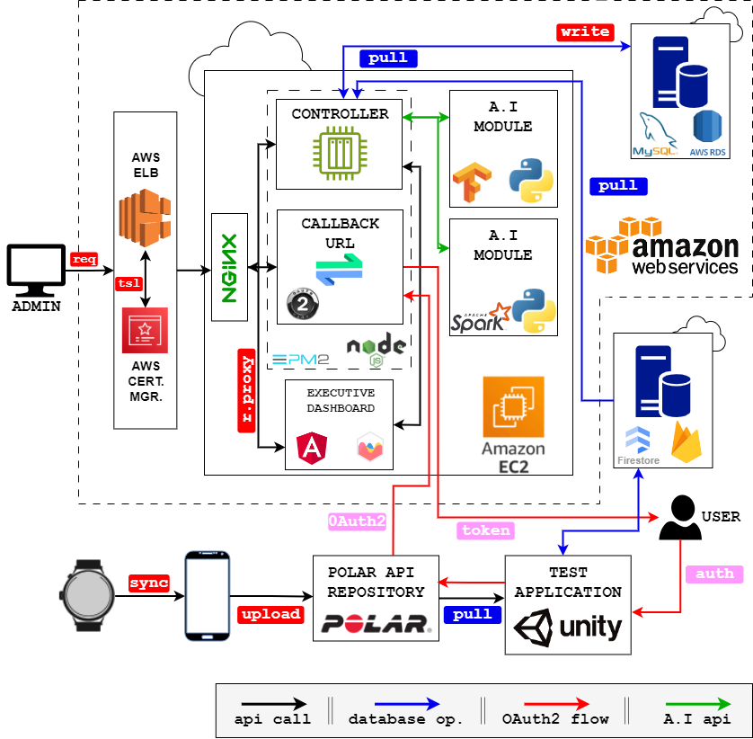
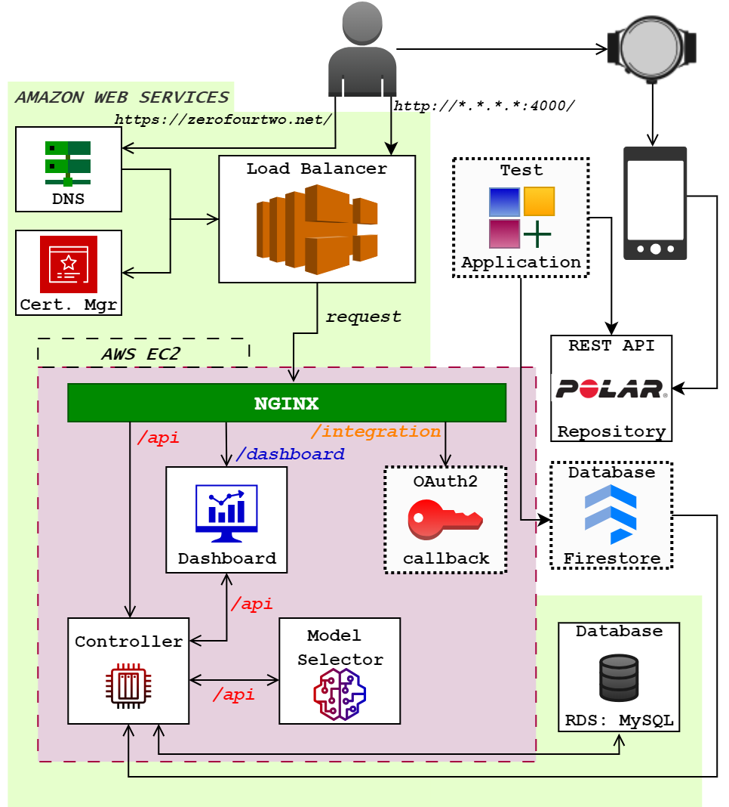
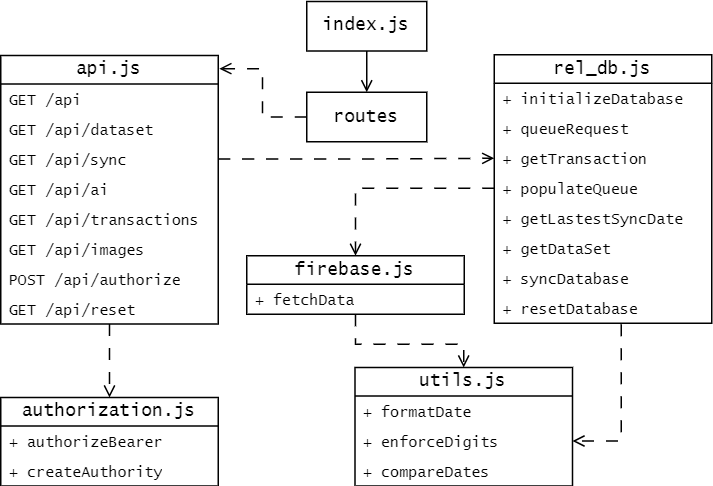
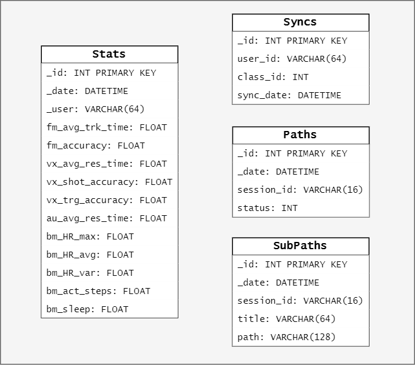
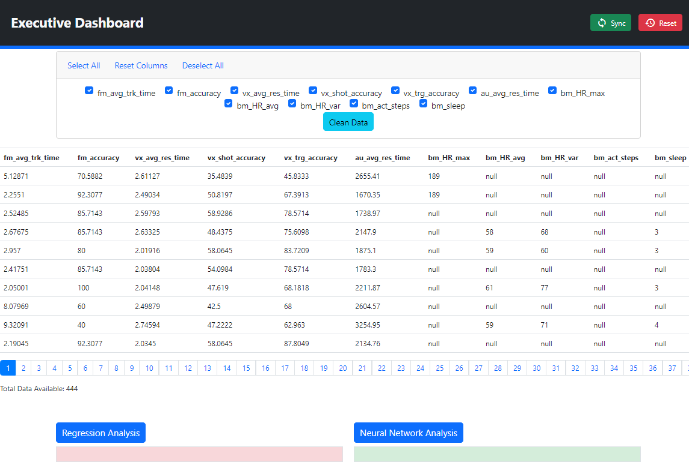
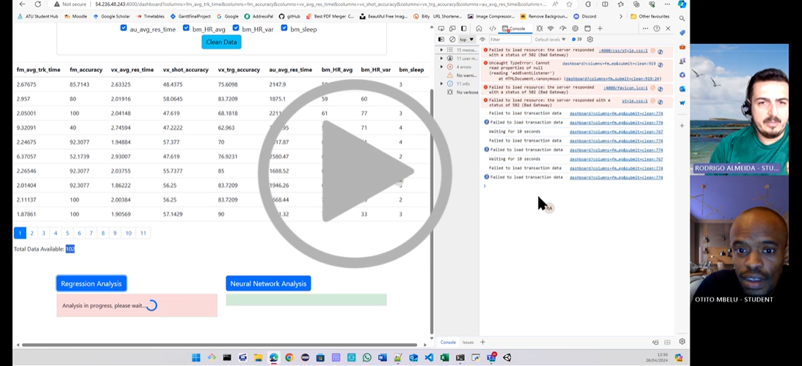

# Biometric Data Analysis in Digital Game Scenario

## Project Objective

This project seeks to answer the following research questions:
- Can users' current physical condition as indicated by their Biometric data,
have any direct relationship with their performance in such gaming scenario?
- Can Biometric and test data help suggest the most suitable settings for
different game scenarios?
Year 4 Project/Minor Dissertation

## Project Summary

The diagram below gives a summary of objectives to be achieved towards successful completion of the project. 


## Proposed System Architecture
The diagram below shows a summary of the system architecture. 


## Final System Architecture



## Controller UML


## Database Schema


## Screenshot


## Screencast
`dissertation/videos/screencast.mp4`


[](
https://atlantictu.sharepoint.com/:v:/s/Student-Year3Project/Ec00e-vwu2BPn4_7Q2HVynYBERmvVTrXGPsoNKjCePZF5w?e=hLNgXZ)

## Controller Source Code
`./controller/src`

## AI Model Source Code
`./tensorflow`

## Dissertation and Documentation
`./dissertation/index.pdf`

# Installations

## Firebase

### Install Firebase Tools
`npm install -g firebase-tools`

### Login to Firebase

`npm firebase login`

### Possible Error Fix

`Set-ExecutionPolicy -ExecutionPolicy Bypass -Scope CurrentUse`

### Initialize Firebase

`firebase init`

### Install Firebase Admin Tools

`npm install firebase-admin --save`

### Install Client Library

`npm install @google-cloud/firestore`

### Install Google Cloud CLI
#### Windows (In Powershell)

```
(New-Object Net.WebClient).DownloadFile("https://dl.google.com/dl/cloudsdk/channels/rapid/GoogleCloudSDKInstaller.exe", "$env:Temp\GoogleCloudSDKInstaller.exe")

& $env:Temp\GoogleCloudSDKInstaller.exe
```

#### Linux (Terminal)

```
curl -O https://dl.google.com/dl/cloudsdk/channels/rapid/downloads/google-cloud-cli-456.0.0-linux-x86_64.tar.gz

tar -xf google-cloud-cli-456.0.0-linux-x86_64.tar.gz

./google-cloud-sdk/install.sh

./google-cloud-sdk/bin/gcloud init
```

### Environment Setup

`npm install dotenv`

### Setup Application Default Credentials (ADC)

`gcloud auth application-default login`

---

## TensorFlow installation and setup

### Upgrading PIP
`pip install --upgrade pip`


### PIP Installation 
```
sudo apt update
sudo apt install python3-pip
sudo pip3 install --upgrade pip
```

### Current stable release for CPU and GPU
```
pip install tensorflow
```
---
## Docker Installation

### Development Machine

- Check the Linux Version: go to the root  `cat /etc/issue`
- Update the apt package index: `sudo apt-get update`
- Install apt-transport-https: `apt-get install apt-transport-https ca-certificates curl gnupg lsb-release`
- Add Docker's official GPG key: ```sudo install -m 0755 -d /etc/apt/keyrings
curl -fsSL https://download.docker.com/linux/ubuntu/gpg | sudo gpg --dearmor -o /etc/apt/keyrings/docker.gpg', sudo chmod a+r /etc/apt/keyrings/docker.gpg ```
- Set up repository: ```
  echo \
  "deb [arch="$(dpkg --print-architecture)" signed-by=/etc/apt/keyrings/docker.gpg] https://download.docker.com/linux/ubuntu \
  "$(. /etc/os-release && echo "$VERSION_CODENAME")" stable" | \
  sudo tee /etc/apt/sources.list.d/docker.list > /dev/null ```
- Install Docker engine: ```sudo apt-get update
sudo apt-get install docker-ce docker-ce-cli containerd.io docker-buildx-plugin docker- compose-plugin```
- Create docker group and and your user: ```sudo groupadd docker, sudo usermod -aG docker $USER```
### Production Machine Daemon Installation

`sudo apt-get update`
`sudo apt-get install docker.io -y`
`sudo systemctl start docker`

### Saving Docker Image

`docker save -o <generated tar file name> <docker-name>`

### Running docker Image
`docker run -p <image-port>:<host-port> <docker-image>`

### Transferring docker Image

`scp controller-box.tar.gz ubuntu@100.25.29.105:/home/ubuntu/docker-repos`

---
## PM2 - Daemonize Applications
An application that restarts a node application when the server crashes or starts.
`sudo npm install pm2@latest -g`
`pm2 start index.js`

## Nginx Web Server

Nginx would be used to redirect traffic to the desired endpoint. Endpoints will be generally divided into two: 
- API end point
- Angular endpoint

`sudo apt-get install nginx`


`systemctl status nginx` to make sure it is actually running after installation

## Nginx Configuration file in /etc/nginx/sites-available

```
server {
        listen 4000;

        server_name zerofourtwo.net;

        location / {
                proxy_pass http://localhost:4004;
        }

        location /api {
                proxy_pass http://localhost:3000;
        }

        location /dashboard {
                proxy_pass http://localhost:4200;
        }
}

```

## Installing Scikit-learn

`pip install -U scikit-learn`

## Running Controller

### Installing node dependencies
`npm install`

### Running as daemon  

`pm2 start ./src/index.js`

### JSON Web Token

`npm install jsonwebtoken`

### Install Mocha

`npm install --global mocha`